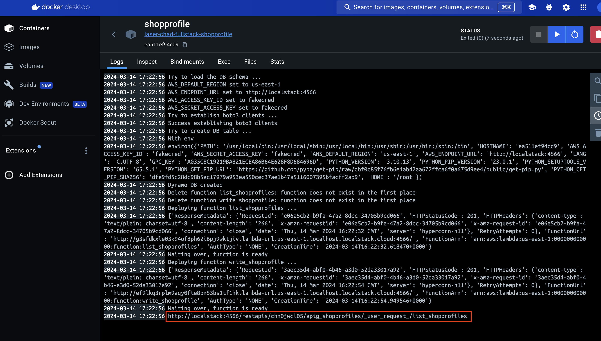
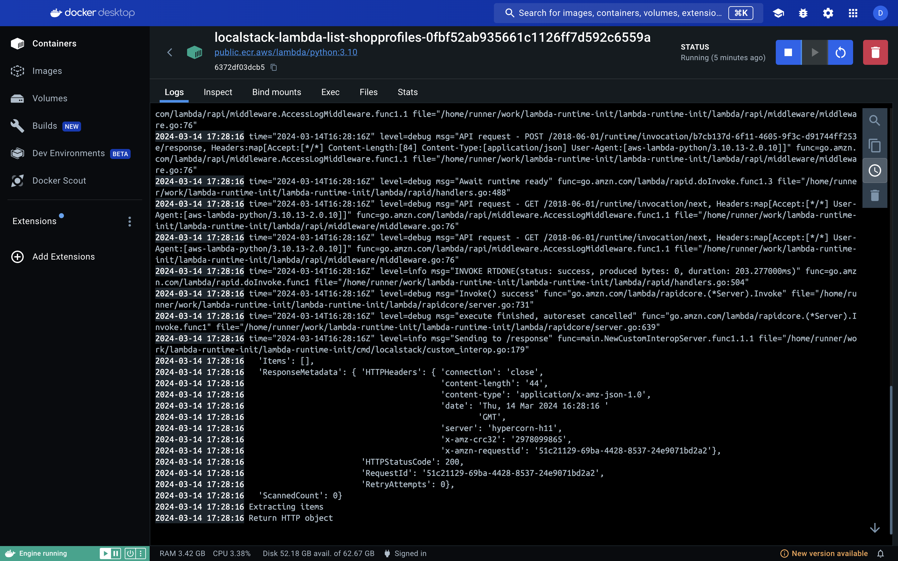

A minimal example of a backend service setup. Consists of three components
- API Gateway
- Lambda functions
- Dynamo DB

The example should simulate a minimal shopprofile Dynamo DB which list all entries (lambda function list_shopprofiles) and put an entry (lambda function write_shopprofile)  
The workflow is as follows:
- `docker compose up -d --build` to start the containers. The following services (frontend and other services ignored) are started:
    - localstack
    - shopprofile. This container runs the `deploy.py` script which sets up all the AWS services on the localstack container
    - shopprofile-debugger. Same as shopprofile but keeps running. Can be used to `docker exec -it shopprofile-debugger /bin/sh` and test a curl on the deployed API
- Wait (ca 30sec) until the shopprofile container exits, this means that the deployment is over (can check the logs in the container)

## Test lambda functions manually
To test the functionality, the script `test/test_services.py` can be run with the docker command listed in the beginning. It copies the file into the running shopprofile-debugger and runs it to see the invocations of the lambda functions

## Test API endpoint
The API endpoint is not yet set up with an interface. In the log of the shopprofile container, the API endpoint is printed in the end, looks something like this:
- `http://localstack:4566/restapis/{API_ID}/apig_shopprofiles/_user_request_/list_shopprofiles`
where API_ID is created upon deployment of the API Gateway service.

To test it, use the shopprofile-debugger container:
- `docker exec -it shopprofile-debugger /bin/sh` to connect to the container
- curl -v <API_ENDPOINT> to see the result
- This request is then visible in a new container, spun up by localstack which is called `localstack-lambda-list-shopprofiles-{RESOURCE_ID}`. The request and any prints from the lambda handler can be seen there.

## TODO
- lambda function `write_shopprofile` is not yet set up with the API gateway
    - Need to add a API method and integration in the `deploy.py` file
    - Need to change return value of the handler so that a valid HTTP response is generated for the API
    - Need deeper understanding of the integration and how to map query parameters, path parameters, header and body to inputs for the lambda funciton